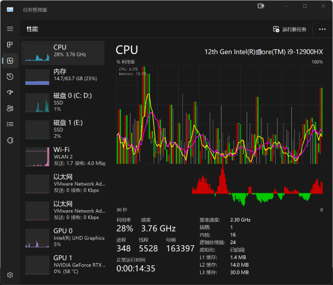
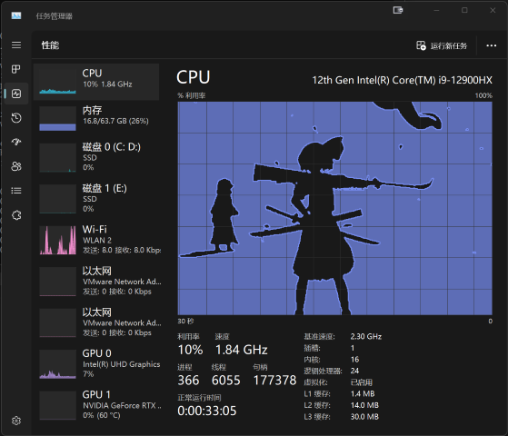

# TradeMgr (TaskmgrPlayer + TaskmgrTrader)

> 一个让Windows任务管理器展示 视频 和 K线图 的小玩具
>
> A toy for displaying videos and candlestick charts in Windows Task Manager

## 🌟 项目介绍 | Introduction

TradeMgr 是一个基于 [svr2kos2/TaskmgrPlayer](https://github.com/svr2kos2/TaskmgrPlayer) 的修改版项目，新增了 TaskmgrTrader ，能够在任务管理器中展示将CPU占用显示为股票 K 线图。引入了夜间模式适配，提供了更好的视觉体验。

TradeMgr is an modified version of [svr2kos2/TaskmgrPlayer](https://github.com/svr2kos2/TaskmgrPlayer). It introduces the TaskmgrTrader module, which can display stock candlestick charts in Task Manager. This project features dark mode compatibility for a better visual experience.




## ✨ 功能特性 | Features

### TaskmgrPlayer
- 🎬 在Windows任务管理器的CPU性能图上播放视频
- 🎯 支持在任意指定窗口上播放视频
- 🌓 新增夜间模式适配
- 🛠️ 可配置的显示参数

### TaskmgrTrader
- 📊 在任务管理器中展示K线图
- 📈 实时监控CPU占用率并以K线形式展示

## 🚀 快速开始 | Quick Start

### 系统要求 | Requirements
- Windows操作系统
- Visual Studio（用于编译）
- OpenCV库

### 安装步骤 | Installation
1. 克隆仓库：
   ```
   git clone https://github.com/uarix/TradeMgr.git
   ```
2. 使用Visual Studio打开项目
3. 确保已安装OpenCV依赖（需要手动调整项目配置中的OpenCV路径）
4. 编译项目

## 📝 配置说明 | Configuration
通过修改`config.cfg`文件，您可以自定义程序的各种参数。该文件默认使用UTF-8编码。

You can customize various parameters by modifying the `config.cfg` file. This file uses UTF-8 encoding by default.

### TaskmgrPlayer配置 | TaskmgrPlayer Configuration

要更改目标显示窗口，您需要了解Windows窗口的组成结构，并学会使用Spy++来获取目标窗口的路径。播放的视频默认使用二值化后边缘检测的后处理。

To change the target display window, you need to understand the structure of Windows windows and learn to use Spy++ to obtain the path of the target window. The played video uses post-processing with edge detection after binarization by default.

颜色格式采用BGR格式：
Colors are in BGR format:

- **WindowName**: 窗口标题 | Window title
- **WindowClass**: 窗口类 | Window class
- **ChildName**: 子窗口的类（使用了同一个类的子窗口，默认选择最大的那一个）| Child window class (for child windows using the same class, the largest one is selected by default)
- **ColorEdge**: 边缘的颜色 | Edge color
- **ColorDark**: 二值化后黑色转换成的颜色 | Color that black is converted to after binarization
- **ColorBright**: 二值化后白色转换的颜色 | Color that white is converted to after binarization
- **ColorGrid**: 背景网格的颜色 | Background grid color
- **ColorFrame**: 外围边框的颜色 | Outer frame color

## 🤝 贡献 | Contributing

欢迎提交问题报告、功能请求或直接提交代码贡献。

Issue reports, feature requests, or direct code contributions are welcome

## 📄 许可证 | License

[GPL-3.0 license](LICENSE)

